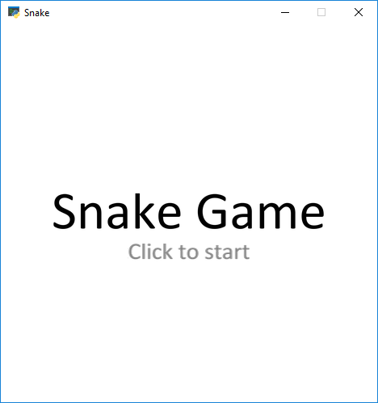
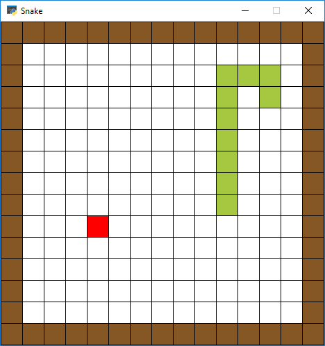
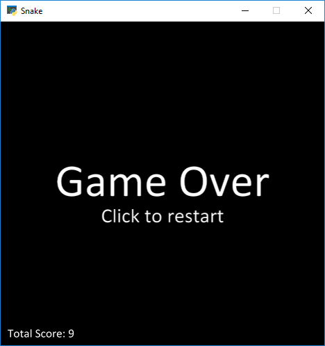

# Snake_AI (Work in progress...)

Implementation of Snake game and reinforcement learning agent playing it.

## Requirements
Python 3.7  
arcade 2.1.3

## Run

So far only the first version of the game is implemented.  
To play simply execute main.py file and follow instructions.  
Control the snake with arrow keys. 

  
